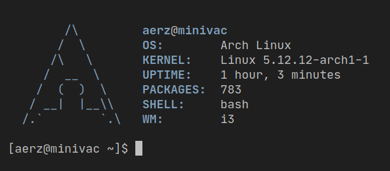

# dotfiles



- **OS**: [Arch Linux](https://archlinux.org)
- **WM**: [i3-gaps](https://github.com/Airblader/i3)
- **Bar**: [Polybar](https://github.com/polybar/polybar)
- **Shell**: [Bash](https://www.gnu.org/software/bash/)
- **Terminal emulator**: [Alacritty](https://github.com/alacritty/alacritty)
- **Editor**: [Visual Studio Code](https://code.visualstudio.com/)
- **Icon theme**: [Papirus](https://github.com/PapirusDevelopmentTeam/papirus-icon-theme)
- **Color Scheme**: Custom based on [Min Tomorrow Theme](https://github.com/musm/min-tomorrow-theme)

# Details

## Software

| Package                                                                       | Description                                         |
| ----------------------------------------------------------------------------- | --------------------------------------------------- |
| [rofi](https://github.com/davatorium/rofi)                                    | Dmenu replacement                                   |
| [playerctl](https://github.com/altdesktop/playerctl)                          | Fetch metadata about what is being played           |
| [ponymix](https://github.com/falconindy/ponymix)                              | Pulseaudio frontend to control output/input devices |
| [regolith-rofication](https://github.com/regolith-linux/regolith-rofication)  | Minimal notification daemon                         |
| [paru](https://github.com/morganamilo/paru)                                   | AUR helper                                          |
| [shotgun](https://github.com/neXromancers/shotgun)                            | Minimal screenshot utility                          |
| [multilockscreen](https://github.com/jeffmhubbard/multilockscreen)            | Lockscreen                                          |
| [XFCE Settings Daemon](https://docs.xfce.org/xfce/xfce4-settings/xfsettingsd) | Control dark/light themes and global settings       |
| [nitrogen](https://github.com/l3ib/nitrogen)                                  | Background setter                                   |
| [sxiv](https://github.com/muennich/sxiv)                                      | Image viewer                                        |
| [Zathura](https://pwmt.org/projects/zathura)                                  | Document viewer                                     |
| [keychain](https://www.funtoo.org/Keychain)                                   | SSH and GPG key manager                             |

## Fonts

- [Inter](https://rsms.me/inter) - System UI, Sans serif
- [JetBrainsMono Nerd Font](https://www.nerdfonts.com) - Monospace + Icons
- [Google Noto Emojis](https://www.google.com/get/noto/) - Emojis

## Wallpaper

My wallpaper is slightly edited, you can find it [here](img/wallpaper.jpg) and the [original](https://unsplash.com/photos/RRLb2zFzRK8) is by Timusic Photographso published on Unsplash.

# Installation

```shell
git clone https://github.com/aerz/dotfiles ~/.config/dotfiles
go get github.com/erizocosmico/dotman
cd ~/.config/dotfiles
dotman -config dotman.yaml
```

## Additional configuration scripts

- `config/multilock/generate` Executed with the wallpaper path as first argument will configure multilockscreen
- `config/dconf/configure` Configure dconf database using gsettings, this step is required because of many apps use this configuration first
